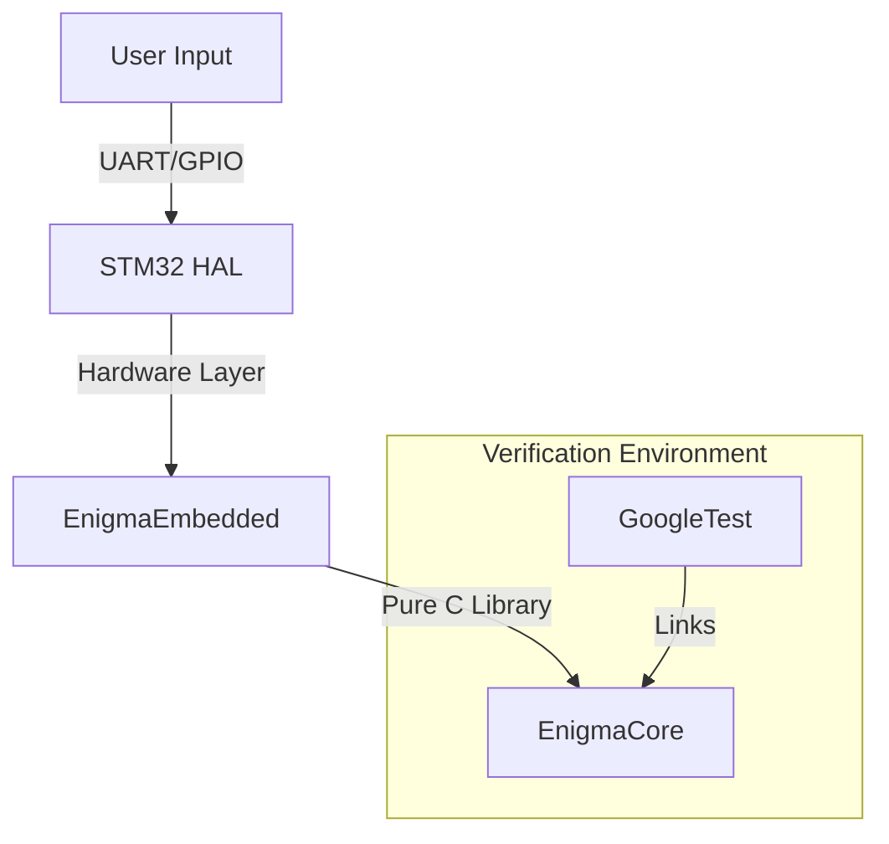

# Virtual Enigma


A modular, embedded-focused implementation of the historic Enigma Machine. This project demonstrates clean architecture principles by decoupling core cryptographic logic from hardware specifics, allowing the engine to run on both PC (for testing/verification) and STM32 microcontrollers.

## Demonstration

System showcase on the STM32 hardware:

[](https://www.youtube.com/watch?v=m-f12p9_2no)

---

## Project Architecture

This repository is structured to demonstrate **separation of concerns** and **test-driven development** in an embedded context.

| Module                  | Description                                                                                                                                   |
|:------------------------|:----------------------------------------------------------------------------------------------------------------------------------------------|
| **`EnigmaCore/`**       | Platform-agnostic C99 library. Implements the mathematical model of Rotors, Reflectors, and the Plugboard. Contains no hardware dependencies. |
| **`EnigmaEmbedded/`**   | Hardware Abstraction Layer (HAL) for STM32L476RG. Handles GPIO, UART, and System Clock configuration using STM32CubeMX.                       |
| **`EnigmaDisplay/`**    | Interface layer for visualization and user interaction on Nextion display.                                                                    |
| **`EnigmaCore/tests/`** | Unit test suite using GoogleTest to verify cryptographic accuracy against known Enigma vectors.                                               |

### System Diagram


## Tech Stack

*   **Language:** C (Core Logic), C++ (Unit Tests)
*   **Hardware:** STM32L476RG (Nucleo-64), Nextion NX4827T043_011
*   **Build System:** CMake
*   **Testing Framework:** GoogleTest (GTest)
*   **Tools:** STM32CubeMX, GCC ARM Embedded Toolchain, Nextion Editor

---

## Getting Started

### Prerequisites
*   CMake (3.16+)
*   GCC / G++
*   ARM None EABI GCC (for embedded target)
*   Ninja or Make

### Building the Core & Running Tests
The core logic is verified on the host machine using GoogleTest to ensure encryption accuracy before deploying to hardware.

```bash
# 1. Clone the repository
git clone https://github.com/Byenio/virtual-enigma.git
cd virtual-enigma

# 2. Build the project
mkdir build && cd build
cmake ..
make

# 3. Run Unit Tests
./EnigmaCore/tests/enigma_test
```

### Building for STM32
To compile the firmware for the STM32L476 target:

```bash
# From the build directory
cmake -DCMAKE_TOOLCHAIN_FILE=../EnigmaEmbedded/cmake/gcc-arm-none-eabi.cmake ..
make EnigmaEmbedded
```

---

## Key Features Implementation

### 1. Cryptographic Core (`EnigmaCore`)
The core logic faithfully recreates the mechanical signal path of the Wehrmacht Enigma I:

*   **Rotors:** Configurable wiring, notches, and turnover positions (I, II, III).
*   **Reflector:** Signal loop-back mechanism (Reflector B).
*   **Plugboard:** Character swapping for additional entropy.

Additionally, rotors IV and V their notches, A and C reflectors are pre-configured and ready to use.

### 2. Embedded Implementation (`EnigmaEmbedded`)
*   **Optimized for constrained environments:** Low memory footprint.
*   **Interrupt-driven I/O:** Efficient handling of user inputs.
*   **Hardware Abstraction:** Separation of drivers allows easy porting to other ARM Cortex-M chips.

Communication between STM32 and the Nextion display uses set of commands:

* **MSG:** Containing message to be encrypted
* **CFG:** Representing configuration change requested by user
  * **ROT:** Containing rotor configuration request (move up or down)
  * **REF:** Containing reflector configuration request (change reflector)
* **CMD:** Representing system command
  * **RESET** Resetting entire machine configuration
  * **UPDATE** Updating displays (contents, styles)

### 3. Verification
Unit tests in `EnigmaCore/tests/` ensure that:
*   Encryption is symmetric (`A` -> `B` implies `B` -> `A`).
*   Rotor stepping occurs at correct notch positions.
*   Plugboard swaps are applied correctly.

```cpp
// Example Test Case from project
TEST_F(EnigmaMachineTest, EncryptsAAAAAtoBDZGO) {
    char buffer[] = "AAAAA";
    EnigmaEncryptString(&machine, buffer);
    EXPECT_STREQ(buffer, "BDZGO");
}
```

---

## License
This project is licensed under the MIT License - see the [LICENSE](LICENSE) file for details.